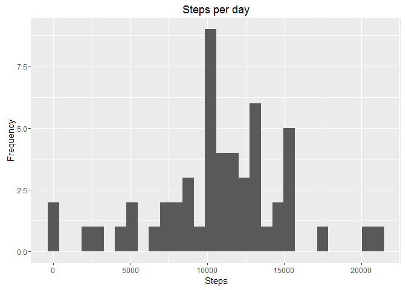
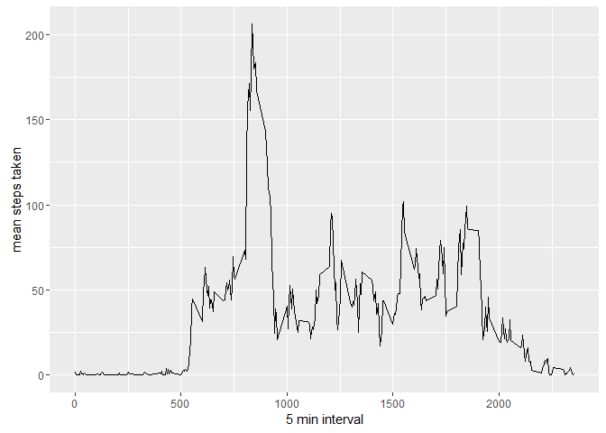
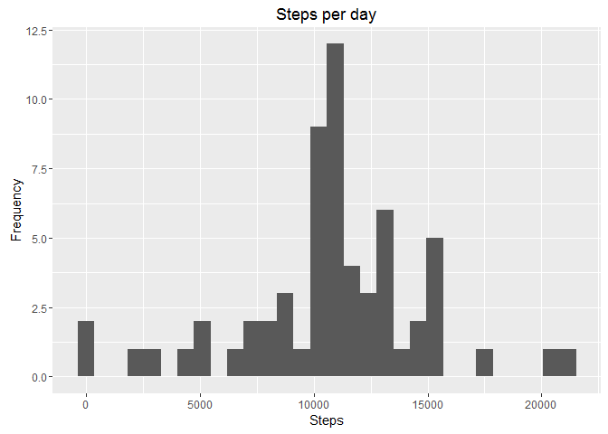
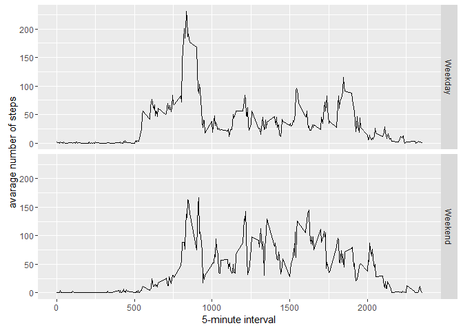

# Reproducible Research: Peer Assessment 1


```r
#libraries setup and function helpers
library('knitr')
library('ggplot2')
library('lubridate')
setAs("character","myDate", function(from) as.Date(from, format="%Y-%m-%d"))
#to format inline code:
inline_hook <- function(x) {
  if (is.numeric(x)) {
    format(round(x, 2), nsmall = 2)
  } else x
}
knitr::knit_hooks$set(inline = inline_hook)
```

## Loading and preprocessing the data

### 1. Load the data (i.e. read.csv())
##### The first step will be loading the data from the source file activity.csv:


```r
if(!file.exists('activity.csv')){
    if(!file.exists('activity.zip')){
        stop("File not available")
    }
    unzip('activity.zip')
    
}
activity <- read.csv(file= "activity.csv",header = TRUE,colClasses=c('numeric','myDate','numeric'))
```


### 2. Process/transform the data (if necessary) into a format suitable for your analysis
##### This was already taken care off in the read.csv function, I used at top of this sript, the next function to transform from format to date class:

```r
setAs("character","myDate", function(from) as.Date(from, format="%Y-%m-%d"))
```


## What is mean total number of steps taken per day?


```r
stepsByDate <- aggregate(steps ~ date, data = activity, sum, na.rm = TRUE)
kable(head(stepsByDate))
```


date          steps
-----------  ------
2012-10-02      126
2012-10-03    11352
2012-10-04    12116
2012-10-05    13294
2012-10-06    15420
2012-10-07    11015

### 1. Make a histogram of the total number of steps taken each day

```r
ggplot(stepsByDate, aes(x = steps)) +
  geom_histogram() +
  labs(title = "Steps per day", x = "Steps", y = "Frequency")
```

<!-- -->

### 2. Calculate and report the mean and median total number of steps taken per day

```r
meanSteps <- mean(stepsByDate$steps)
medianSteps <- median(stepsByDate$steps)
```

The mean is 10766.19 and the median is 10765.00


## What is the average daily activity pattern?
### 1. Make a time series plot (i.e. type = "l") of the 5-minute interval (x-axis) and the average number of steps taken, averaged across all days (y-axis)

```r
stepsInterval <- aggregate(steps ~ interval, data = activity, mean, na.rm = TRUE)
ggplot(data=stepsInterval, aes(x=interval, y=steps)) +
    geom_line() +
    xlab("5 min interval") +
    ylab("mean steps taken") 
```

<!-- -->
### 2. Which 5-minute interval, on average across all the days in the dataset, contains the maximum number of steps?

```r
maxStepsInt <- stepsInterval[stepsInterval$steps==max(stepsInterval$steps),]$interval
```
The 5 min interval with the max number os steps is 835.00

## Imputing missing values
### 1. Calculate and report the total number of missing values in the dataset (i.e. the total number of rows with NAs)

```r
totalNA <- sum(is.na(activity$steps))
```
The total number of rows with NAs is 2304.00 

### 2. Devise a strategy for filling in all of the missing values in the dataset
I'll use the suggestion from the instructor, to use the mean for that particular interval. I'll use this subset:


```r
stepsMeanByInterval <- aggregate(steps ~ interval, data = activity, mean)
```

### 3. Create a new dataset that is equal to the original dataset but with the missing data filled in

From the previous step I can search for the NA values in the activity dataset and
fill it with the mean step values from stepsMeanByInterval:

```r
newActivity <- activity

for (i in 1:nrow(newActivity)) {
    if (is.na(newActivity[i, ]$steps)) {
        newActivity[i,]$steps <- stepsMeanByInterval[stepsMeanByInterval$interval==newActivity[i, ]$interval,]$steps
    }
}
```

### 4. Make a histogram of the total number of steps taken each day and Calculate and report the mean and median total number of steps taken per day. Do these values differ from the estimates from the first part of the assignment? What is the impact of imputing missing data on the estimates of the total daily number of steps?


```r
stepsByDateNew <- aggregate(steps ~ date, data = newActivity, sum, na.rm = TRUE)
ggplot(stepsByDateNew, aes(x = steps)) +
  geom_histogram() +
  labs(title = "Steps per day", x = "Steps", y = "Frequency")
```

<!-- -->

Calculating the media and mean:

```r
meanStepsNew <- mean(stepsByDateNew$steps)
medianStepsNew <- median(stepsByDateNew$steps)
```
Mean: 10766.19
Median: 10766.19


## Are there differences in activity patterns between weekdays and weekends?

### 1. Create a new factor variable in the dataset with two levels -- "weekday" and "weekend"

```r
newActivity$weekType <- as.factor(ifelse(weekdays(newActivity$date) %in% c("Saturday","Sunday"), "Weekend", "Weekday"))
kable(head(newActivity))
```

     steps  date          interval  weekType 
----------  -----------  ---------  ---------
 1.7169811  2012-10-01           0  Weekday  
 0.3396226  2012-10-01           5  Weekday  
 0.1320755  2012-10-01          10  Weekday  
 0.1509434  2012-10-01          15  Weekday  
 0.0754717  2012-10-01          20  Weekday  
 2.0943396  2012-10-01          25  Weekday  

### 2. Make a panel plot containing a time series plot

```r
averActivity <- aggregate(steps ~ interval + weekType, data=newActivity, mean)
ggplot(averActivity, aes(interval, steps)) + 
    geom_line() + 
    facet_grid(weekType ~ .) +
    xlab("5-minute interval") + 
    ylab("avarage number of steps")
```

<!-- -->
